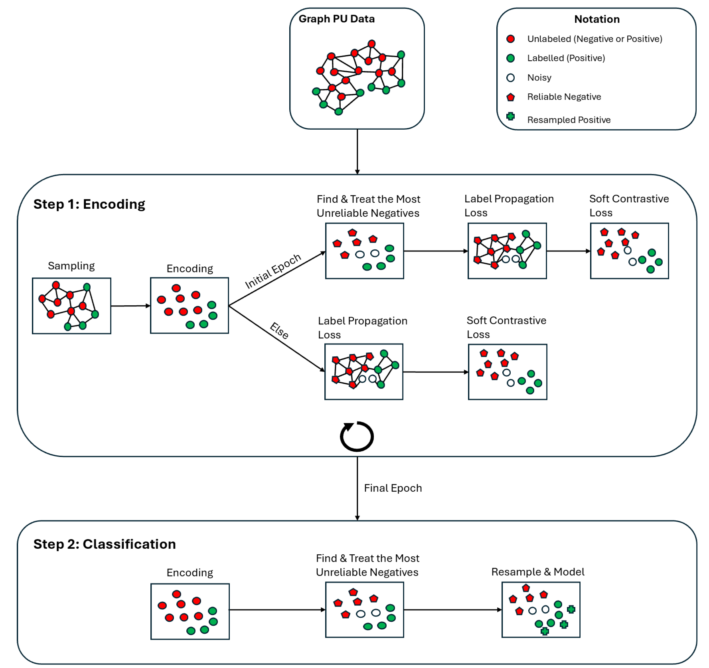

# GNN–NNIF: Graph Neural Networks for Positive–Unlabelled Node Classification



## About

Positive–unlabelled (PU) learning is critical in domains where reliable negative labels are scarce, yet existing graph‑based approaches often falter on large networks or depend on precise class‑prior estimates. **GNN–NNIF** is a scalable two‑stage framework that couples mini‑batch Graph Neural Network (GNN) representation learning with a Nearest‑Neighbour Isolation Forest (NNIF) to address scalability, label noise and severe class imbalance.

### Stage 1 — Representation & Reliable Negatives

* Mini‑batch sampling on large graphs.
* Joint **label‑propagation + soft‑margin contrastive** loss yields balanced, discriminative embeddings.
* **Nearest‑Neighbour Isolation Forest** removes anomalous unlabelled nodes, producing a reliable‑negative set.

### Stage 2 — Rebalancing & Classification

* **ADASYN** oversamples minority (positive) nodes in the embedding space.
* An **XGBoost** classifier is trained on the balanced embeddings for final prediction.

## Results

Experiments under **SCAR** and **SAR** labelling on Cora, Citeseer, Pubmed, Wiki‑CS and the highly imbalanced Elliptic Bitcoin graph show that GNN–NNIF matches or surpasses state‑of‑the‑art methods. When fewer than 25 % of positives are observed, F1 scores remain consistently higher than competing methods; on Elliptic the framework improves F1 by **15.19 %** over the strongest baseline.

## Limitations & Future Work

* Residual class overlap inherent to the two‑stage scheme.
* Computational overhead from exact k‑nearest‑neighbour searches.
* Non‑trivial hyper‑parameter tuning.

Future work should explore adaptive pollution‑ratio estimation, scalable approximate nearest‑neighbour algorithms and more sophisticated techniques for handling unreliable negatives.

## Usage

```bash
python ./NNIF-GNN/train_NNIF_GNN.py
```
